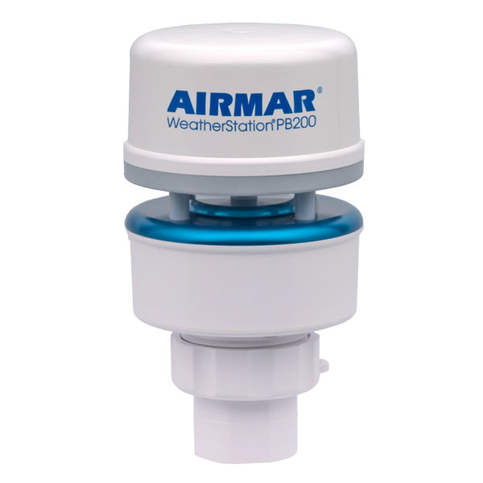

|    Metrics    |                                                                                     Master                                                                                     |                                                                                  Develop                                                                                 |
|:-------------:|:------------------------------------------------------------------------------------------------------------------------------------------------------------------------------:|:------------------------------------------------------------------------------------------------------------------------------------------------------------------------:|
| CI status     | [](https://gitlab.com/redmic-project/device/oag-buoy/pb200/commits/master) | [](https://gitlab.com/redmic-project/device/oag-buoy/pb200/commits/dev) |
| Test coverage | [](https://gitlab.com/redmic-project/device/oag-buoy/pb200/commits/master) | [](https://gitlab.com/redmic-project/device/oag-buoy/pb200/commits/dev) |


# PB200



* Lee datos desde el estación meteorológica PB200 o 200WX. 
* Guarda los datos en una base de datos PostgreSQL
* Publica los datos utlizando el protocolo MQTT


## Detección del dispositivo
Para conectar la estación al equipo se han utilizado los conversores FTDI. De esta forma se facilita la tarea
de identificación del dispositivo utilizando reglas UDEV. En este caso hay 2 reglas ya que hay 2 conectores, uno
para pruebas/ reemplazo y el que está en funcionamiento.

```
ACTION=="add", SUBSYSTEM=="tty", ATTRS{idProduct}=="6001", ATTRS{idVendor}=="0403", ATTRS{serial}=="FTZ2PYCP", SYMLINK+="weather_station_pb200"
ACTION=="add", SUBSYSTEM=="tty", ATTRS{idProduct}=="6001", ATTRS{idVendor}=="0403", ATTRS{serial}=="FTZ2HJ6H", SYMLINK+="weather_station_pb200"
```

## Configuración
La configuración del servicio es necesario pasarla a través de un fichero YAML, por defecto debe estar en /etc/buoy/pb200 y
se debe llamar device.yaml.

```buildoutcfg
service:
    path_pidfile: /var/run/buoy/
    start_timeout: 1

database:
    database: database
    user: username
    password: password
    host: localhost

serial:
    port: /dev/weather_station_pb200
    baudrate: 4800
    stopbits: 1
    parity: N
    bytesize: 8
    timeout: 0

mqtt:
    broker_url: iot.eclipse.org
    client_id: client_id
    topic_data: topic_name
    username: username
    password: changeme
```

También debe de haber otro fichero logging.yaml donde se define el nivel de log y donde se vuelcan.

```buildoutcfg
version: 1
disable_existing_loggers: False
formatters:
    simple:
        format: '%(asctime)s - %(name)s - %(levelname)s - %(message)s'
    detail:
        format: '%(asctime)s - %(levelname)s - File: %(filename)s - %(funcName)s() - Line: %(lineno)d -  %(message)s'

handlers:
    console:
        class: logging.StreamHandler
        level: INFO
        formatter: simple
        stream: ext://sys.stdout
root:
    level: INFO
    handlers: [console]
```

## Arranque del servicio
Utilizando las reglas de UDEV, se puede detectar cuando el dispositivo está conectado y entonces iniciar
el servicio de recogida, guardado y envío de datos de forma automática. Para ello, se hay de crear un servicio
en systemd que se arranque con la presencia del dispositivo.

```buildoutcfg
[Unit]
Description=Weather Station - PB200
After=multi-user.target dev-weather_station_pb200.device
BindsTo=dev-weather_station_pb200.device

[Service]
Type=idle
ExecStart=/usr/local/bin/weather-station-pb200
PIDFile=/var/run/buoy/pb200.pid
ExecStop=/usr/bin/pkill -15 /var/run/buoy/pb200.pid
TimeoutStopSec=5
Restart=on-failure

[Install]
WantedBy=dev-weather_station_pb200.device
```

El fichero es necesario copiarlo en /etc/systemd/system/, recargar y activar el servicio.
```
sudo cp weather-station-pb200.service /etc/systemd/system/
sudo systemctl daemon-reload 
sudo systemctl enable weather-station-pb200.service
```

Y por último iniciar el servicio.

```
sudo systemctl start weather-station-pb200.service
```